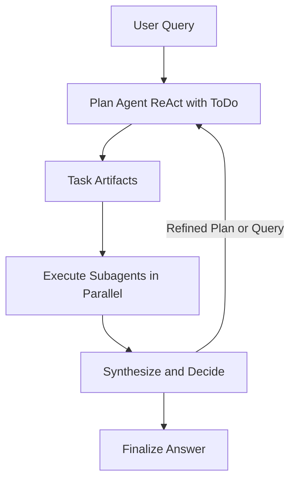

# Workflow Architecture

Structured pipeline reflecting the same roles with a fixed sequence.

---

## Sequence

1. **Plan (ReAct)**
   - A plan module/agent maintains a **To-Do List** of high-level plans using `todo_list_read` and `todo_list_write`.
   - Reads existing artifacts through `filesystem_tree` then `filesystem_read` to maintain context.
   - Emits a set of **parallelizable tasks** as artifacts for subagents.
   - Add `expected_output` when you already know the deliverable; leave it out when the task is exploratory.

2. **Execute (parallel)**
   - Spawn subagents using `subagent_run` (single) or `parallel_tool_call` with multiple `subagent_run` calls (parallel).
   - Each subagent uses `web_search` and may call `filesystem_write(path, markdown)`.
   - Each returns a structured summary with optional detail and `artifact_path`.

3. **Synthesize (decide)**
   - Lead reads artifacts and integrates results.
   - **Outputs either**:
     - **Done** → finalize answer, or
     - **Plan** → re-plan with a **refined query / updated To-Dos** and loop again.

4. **Iterate (optional)**
   - If “Plan,” update the To-Do List and generate additional tasks; then repeat Execute → Synthesize.

---

## Diagram

---

## Memory layout

- `memory/` is the sandbox root shared by all tools.
- Each cycle writes to `memory/cycle_<index:03d>/`.
- Planner outputs land at `memory/cycle_<index:03d>/<plan_filename>.md`.
- Each subagent writes `memory/cycle_<index:03d>/<task_name>/result.md`.
- Synthesis lives at `memory/cycle_<index:03d>/synthesis.md`.
- Final reports save to `memory/cycle_<index:03d>/final_report.md`.
